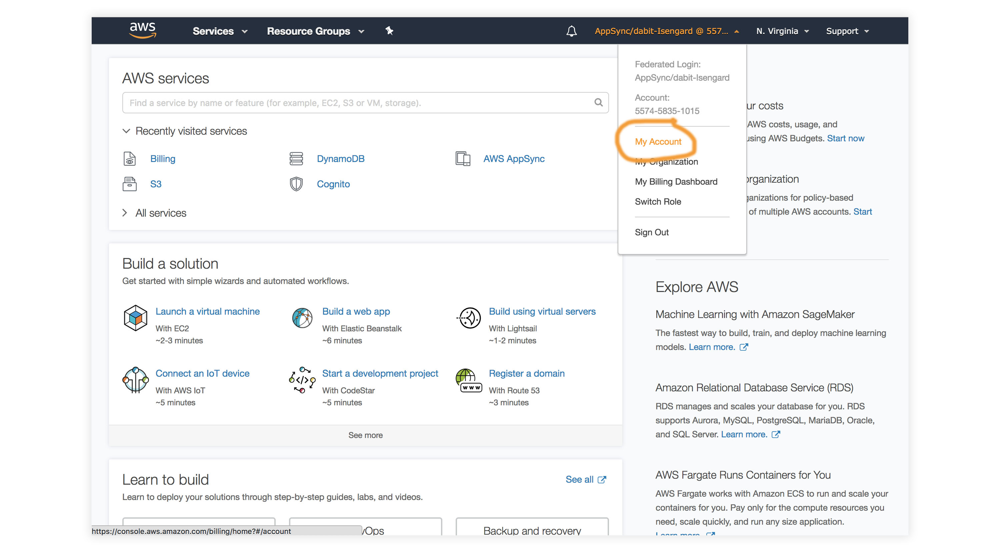
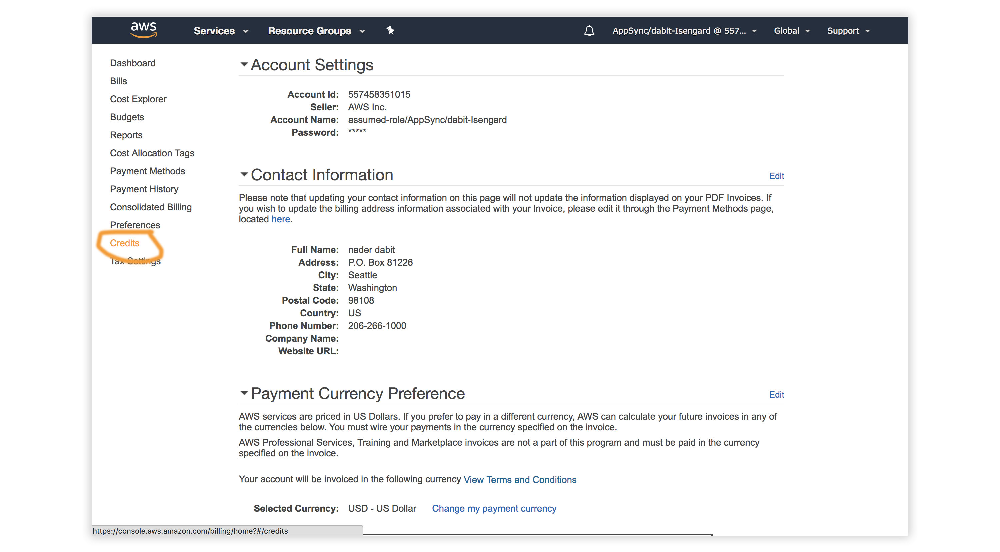

# Building real-time applications with React, GraphQL & AWS AppSync

In this workshop we'll learn how to build cloud-enabled web applications with React, [AppSync](https://aws.amazon.com/appsync/), GraphQL, & [AWS Amplify](https://aws-amplify.github.io/).


### Topics we'll be covering:

- [GraphQL API with AWS AppSync](https://github.com/dabit3/aws-appsync-react-workshop#adding-a-graphql-api)
- [Mocking and Testing](https://github.com/dabit3/aws-appsync-react-workshop#local-mocking-and-testing)
- [Authentication](https://github.com/dabit3/aws-appsync-react-workshop#adding-authentication)
- [Adding Authorization to the AWS AppSync API](https://github.com/dabit3/aws-appsync-react-workshop#adding-authorization-to-the-graphql-api)
- [Lambda Resolvers](https://github.com/dabit3/aws-appsync-react-workshop#lambda-graphql-resolvers)
- [Deploying the Services](https://github.com/dabit3/aws-appsync-react-workshop#deploying-the-services)
- [Hosting with the Amplify Console](https://github.com/dabit3/aws-appsync-react-workshop#hosting-via-the-amplify-console)
- [Amplify DataStore](https://github.com/dabit3/aws-appsync-react-workshop#amplify-datastore)
- [Deleting the resources](https://github.com/dabit3/aws-appsync-react-workshop#removing-services)

## Redeeming the AWS Credit   

1. Visit the [AWS Console](https://console.aws.amazon.com/console).
2. In the top right corner, click on __My Account__.

3. In the left menu, click __Credits__.


## Getting Started - Creating the React Application

To get started, we first need to create a new React project using the [Create React App CLI](https://github.com/facebook/create-react-app).

```bash
$ npx create-react-app my-amplify-app
```

Now change into the new app directory & install the AWS Amplify, AWS Amplify React, & uuid libraries:

```bash
$ cd my-amplify-app
$ npm install --save aws-amplify aws-amplify-react uuid
# or
$ yarn add aws-amplify aws-amplify-react uuid
```

## Installing the CLI & Initializing a new AWS Amplify Project

### Installing the CLI

Next, we'll install the AWS Amplify CLI:

```bash
$ npm install -g @aws-amplify/cli
```

Now we need to configure the CLI with our credentials:

```sh
$ amplify configure
```

> If you'd like to see a video walkthrough of this configuration process, click [here](https://www.youtube.com/watch?v=fWbM5DLh25U).

Here we'll walk through the `amplify configure` setup. Once you've signed in to the AWS console, continue:
- Specify the AWS Region: __us-east-1 || us-west-2 || eu-central-1__
- Specify the username of the new IAM user: __amplify-workshop-user__
> In the AWS Console, click __Next: Permissions__, __Next: Tags__, __Next: Review__, & __Create User__ to create the new IAM user. Then, return to the command line & press Enter.
- Enter the access key of the newly created user:   
? accessKeyId: __(<YOUR_ACCESS_KEY_ID>)__   
? secretAccessKey:  __(<YOUR_SECRET_ACCESS_KEY>)__
- Profile Name: __amplify-workshop-user__

### Initializing A New Project

```bash
$ amplify init
```

- Enter a name for the project: __amplifyreactapp__
- Enter a name for the environment: __dev__
- Choose your default editor: __Visual Studio Code (or your default editor)__   
- Please choose the type of app that you're building __javascript__   
- What javascript framework are you using __react__   
- Source Directory Path: __src__   
- Distribution Directory Path: __build__   
- Build Command: __npm run-script build__   
- Start Command: __npm run-script start__   
- Do you want to use an AWS profile? __Y__
- Please choose the profile you want to use: __amplify-workshop-user__

Now, the AWS Amplify CLI has iniatilized a new project & you will see a new folder: __amplify__ & a new file called `aws-exports.js` in the __src__ directory. These files hold your project configuration.

To view the status of the amplify project at any time, you can run the Amplify `status` command:

```sh
$ amplify status
```

### Configuring the React applicaion

Now, our resources are created & we can start using them!

The first thing we need to do is to configure our React application to be aware of our new AWS Amplify project. We can do this by referencing the auto-generated `aws-exports.js` file that is now in our src folder.

To configure the app, open __src/index.js__ and add the following code below the last import:

```js
import Amplify from 'aws-amplify'
import config from './aws-exports'
Amplify.configure(config)
```

Now, our app is ready to start using our AWS services.

## Adding a GraphQL API

To add a GraphQL API, we can use the following command:

```sh
$ amplify add api

? Please select from one of the above mentioned services: GraphQL
? Provide API name: ConferenceAPI
? Choose an authorization type for the API: API key
? Enter a description for the API key: <some description>
? After how many days from now the API key should expire (1-365): 365
? Do you want to configure advanced settings for the GraphQL API: No
? Do you have an annotated GraphQL schema? N 
? Do you want a guided schema creation? Y
? What best describes your project: Single object with fields
? Do you want to edit the schema now? (Y/n) Y
```

> When prompted, update the schema to the following:   

```graphql
# amplify/backend/api/ConferenceAPI/schema.graphql

type Talk @model {
  id: ID!
  clientId: ID
  name: String!
  description: String!
  speakerName: String!
  speakerBio: String!
}
```

## Local mocking and testing

To mock and test the API locally, you can run the `mock` command:

```sh
$ amplify mock api

? Choose the code generation language target: javascript
? Enter the file name pattern of graphql queries, mutations and subscriptions: src/graphql/**/*.js
? Do you want to generate/update all possible GraphQL operations - queries, mutations and subscriptions: Y
? Enter maximum statement depth [increase from default if your schema is deeply nested]: 2
```

This should start an AppSync Mock endpoint:

```sh
AppSync Mock endpoint is running at http://10.219.99.136:20002
```

Open the endpoint in the browser to use the GraphiQL Editor.

From here, we can now test the API.

### Performing mutations from within the local testing environment

Execute the following mutation to create a new talk in the API:

```graphql
mutation createTalk {
  createTalk(input: {
    name: "Full Stack React"
    description: "Using React to build Full Stack Apps with GraphQL"
    speakerName: "Jennifer"
    speakerBio: "Software Engineer"
  }) {
    id name description speakerName speakerBio
  }
}
```

Now, let's query for the talks:

```graphql
query listTalks {
  listTalks {
    items {
      id
      name
      description
      speakerName
      speakerBio
    }
  }
}
```

We can even add search / filter capabilities when querying:

```graphql
query listTalksWithFilter {
  listTalks(filter: {
    description: {
      contains: "React"
    }
  }) {
    items {
      id
      name
      description
      speakerName
      speakerBio
    }
  }
}
```

### Interacting with the GraphQL API from our client application - Querying for data

Now that the GraphQL API server is running we can begin interacting with it!

The first thing we'll do is perform a query to fetch data from our API.

To do so, we need to define the query, execute the query, store the data in our state, then list the items in our UI.

#### src/App.js

```js
// src/App.js
import React from 'react';

// imports from Amplify library
import { API, graphqlOperation } from 'aws-amplify'

// import query definition
import { listTalks as ListTalks } from './graphql/queries'

class App extends React.Component {
  // define some state to hold the data returned from the API
  state = {
    talks: []
  }

  // execute the query in componentDidMount
  async componentDidMount() {
    try {
      const talkData = await API.graphql(graphqlOperation(ListTalks))
      console.log('talkData:', talkData)
      this.setState({
        talks: talkData.data.listTalks.items
      })
    } catch (err) {
      console.log('error fetching talks...', err)
    }
  }
  render() {
    return (
      <>
        {
          this.state.talks.map((talk, index) => (
            <div key={index}>
              <h3>{talk.speakerName}</h3>
              <h5>{talk.name}</h5>
              <p>{talk.description}</p>
            </div>
          ))
        }
      </>
    )
  }
}

export default App
```

In the above code we are using `API.graphql` to call the GraphQL API, and then taking the result from that API call and storing the data in our state. This should be the list of talks you created via the GraphiQL editor.

#### Feel free to add some styling here to your list if you'd like 😀

Next, test the app locally:

```sh
$ npm start
```

## Performing mutations

 Now, let's look at how we can create mutations.

 To do so, we'll refactor our initial state in order to also hold our form fields and add an event handler.

 We'll also be using the `API` class from amplify again, but now will be passing a second argument to `graphqlOperation` in order to pass in variables: `API.graphql(graphqlOperation(CreateTalk, { input: talk }))`.

 We also have state to work with the form inputs, for `name`, `description`, `speakerName`, and `speakerBio`.

```js
// src/App.js
import React from 'react';

import { API, graphqlOperation } from 'aws-amplify'
// import uuid to create a unique client ID
import uuid from 'uuid/v4'

import { listTalks as ListTalks } from './graphql/queries'
// import the mutation
import { createTalk as CreateTalk } from './graphql/mutations'

const CLIENT_ID = uuid()

class App extends React.Component {
  // define some state to hold the data returned from the API
  state = {
    name: '', description: '', speakerName: '', speakerBio: '', talks: []
  }

  // execute the query in componentDidMount
  async componentDidMount() {
    try {
      const talkData = await API.graphql(graphqlOperation(ListTalks))
      console.log('talkData:', talkData)
      this.setState({
        talks: talkData.data.listTalks.items
      })
    } catch (err) {
      console.log('error fetching talks...', err)
    }
  }
  createTalk = async() => {
    const { name, description, speakerBio, speakerName } = this.state
    if (name === '' || description === '' || speakerBio === '' || speakerName === '') return

    const talk = { name, description, speakerBio, speakerName, clientId: CLIENT_ID }
    const talks = [...this.state.talks, talk]
    this.setState({
      talks, name: '', description: '', speakerName: '', speakerBio: ''
    })

    try {
      await API.graphql(graphqlOperation(CreateTalk, { input: talk }))
      console.log('item created!')
    } catch (err) {
      console.log('error creating talk...', err)
    }
  }
  onChange = (event) => {
    this.setState({
      [event.target.name]: event.target.value
    })
  }
  render() {
    return (
      <>
        <input
          name='name'
          onChange={this.onChange}
          value={this.state.name}
          placeholder='name'
        />
        <input
          name='description'
          onChange={this.onChange}
          value={this.state.description}
          placeholder='description'
        />
        <input
          name='speakerName'
          onChange={this.onChange}
          value={this.state.speakerName}
          placeholder='speakerName'
        />
        <input
          name='speakerBio'
          onChange={this.onChange}
          value={this.state.speakerBio}
          placeholder='speakerBio'
        />
        <button onClick={this.createTalk}>Create Talk</button>
        {
          this.state.talks.map((talk, index) => (
            <div key={index}>
              <h3>{talk.speakerName}</h3>
              <h5>{talk.name}</h5>
              <p>{talk.description}</p>
            </div>
          ))
        }
      </>
    )
  }
}

export default App
```

## Adding Authentication

Next, let's update the app to add authentication.

To add authentication, we can use the following command:

```sh
$ amplify add auth

? Do you want to use default authentication and security configuration? Default configuration 
? How do you want users to be able to sign in when using your Cognito User Pool? Username
? Do you want to configure advanced settings? No, I am done.   
```

### Using the withAuthenticator component

To add authentication in the React app, we'll go into __src/App.js__ and first import the `withAuthenticator` HOC (Higher Order Component) from `aws-amplify-react`:

```js
// src/App.js, import the new component
import { withAuthenticator } from 'aws-amplify-react'
```

Next, we'll wrap our default export (the App component) with the `withAuthenticator` HOC:

```js
// src/App.js, change the default export to this:
export default withAuthenticator(App, { includeGreetings: true })
```

To deploy the authentication service and mock and test the app locally, you can run the `mock` command:

```sh
$ amplify mock

? Are you sure you want to continue? Yes
```

Next, to test it out in the browser:

```sh
npm start
```

Now, we can run the app and see that an Authentication flow has been added in front of our App component. This flow gives users the ability to sign up & sign in.


### Accessing User Data

We can access the user's info now that they are signed in by calling `Auth.currentAuthenticatedUser()` in `componentDidMount`.

```js
import {API, graphqlOperation, /* new 👉 */ Auth} from 'aws-amplify'

async componentDidMount() {
  // add this code to componentDidMount
  const user = await Auth.currentAuthenticatedUser()
  console.log('user:', user)
  console.log('user info:', user.signInUserSession.idToken.payload)
}
```

## Adding Authorization to the GraphQL API

Next we need to update the AppSync API to now use the newly created Cognito Authentication service as the authentication type.

To do so, we'll reconfigure the API:

```sh
$ amplify update api

? Please select from one of the below mentioned services: GraphQL   
? Choose the default authorization type for the API: Amazon Cognito User Pool
? Do you want to configure advanced settings for the GraphQL API: No, I am done
```

Next, we'll test out the API with authentication enabled:

```sh
$ amplify mock
```
Now, we can only access the API with a logged in user.

You'll notice an __auth__ button in the GraphiQL explorer that will allow you to update the simulated user and their groups.

### Fine Grained access control - Using the @auth directive

####  GraphQL Type level authorization with the @auth directive

For authorization rules, we can start using the `@auth` directive.

What if you'd like to have a new `Comment` type that could only be updated or deleted by the creator of the `Comment` but can be read by anyone?

We could add the following type to our GraphQL schema:

```graphql
# amplify/backend/api/ConferenceAPI/schema.graphql

type Comment @model @auth(rules: [
  { allow: owner, ownerField: "createdBy", operations: [create, update, delete]},
  { allow: private, operations: [read] }
  ]) {
  id: ID!
  message: String
  createdBy: String
}
```

__allow: owner__ - This allows us to set owner authorization rules.   
__allow: private__ - This allows us to set private authorization rules.   

This would allow us to create comments that only the creator of the Comment could delete, but anyone could read.

Creating a comment:

```graphql
mutation createComment {
  createComment(input:{
    message: "Cool talk"
  }) {
    id
    message
    createdBy
  }
}
```

Listing comments:

```graphql
query listComments {
  listComments {
    items {
      id
      message
      createdBy
    }
  }
}
```

Updating a comment:

```graphql
mutation updateComment {
  updateComment(input: {
    id: "59d202f8-bfc8-4629-b5c2-bdb8f121444a"
  }) {
    id 
    message
    createdBy
  }
}
```

If you try to update a comment from someone else, you will get an unauthorized error.

### Relationships

What if we wanted to create a relationship between the Comment and the Talk? That's pretty easy. We can use the `@connection` directive:

```graphql
# amplify/backend/api/ConferenceAPI/schema.graphql

type Talk @model {
  id: ID!
  clientId: ID
  name: String!
  description: String!
  speakerName: String!
  speakerBio: String!
  comments: [Comment] @connection(name: "TalkComments")
}

type Comment @model @auth(rules: [
  { allow: owner, ownerField: "createdBy", operations: [create, update, delete]},
  { allow: private, operations: [read] }
  ]) {
  id: ID!
  message: String
  createdBy: String
  talk: Talk @connection(name: "TalkComments")
}
```

Because we're updating the way our database is configured by adding relationships which requires a global secondary index, we need to delete the old local database:

```sh
$ rm -r amplify/mock-data
```

Now, restart the server:

```sh
$ amplify mock
```

Now, we can create relationships between talks and comments. Let's test this out with the following operations:

```graphql
mutation createTalk {
  createTalk(input: {
    id: "test-id-talk-1"
    name: "Talk 1"
    description: "Cool talk"
    speakerBio: "Cool gal"
    speakerName: "Jennifer"
  }) {
    id
    name
    description
  }
}

mutation createComment {
  createComment(input: {
    commentTalkId: "test-id-talk-1"
    message: "Great talk"
  }) {
    id message
  }
}

query listTalks {
  listTalks {
    items {
      id
      name
      description
      comments {
        items {
          message
          createdBy
        }
      }
    }
  }
}
```

If you'd like to read more about the `@auth` directive, check out the documentation [here](https://aws-amplify.github.io/docs/cli/graphql#auth).

### Groups

The last problem we are facing is that *anyone* signed in can create a new talk. Let's add authorization that only allows users that are in an __Admin__ group to create and update talks.

```graphql
# amplify/backend/api/ConferenceAPI/schema.graphql

type Talk @model @auth(rules: [
  { allow: groups, groups: ["Admin"] },
  { allow: private, operations: [read] }
  ]) {
  id: ID!
  clientId: ID
  name: String!
  description: String!
  speakerName: String!
  speakerBio: String!
  comments: [Comment] @connection(name: "TalkComments")
}

type Comment @model @auth(rules: [
  { allow: owner, ownerField: "createdBy", operations: [create, update, delete]},
  { allow: private, operations: [read] }
  ]) {
  id: ID!
  message: String
  createdBy: String
  talk: Talk @connection(name: "TalkComments")
}
```

Run the server:

```sh
$ amplify mock
```

Click on the __auth__ button and add __Admin__ the user's groups.

Now, you'll notice that only users in the __Admin__ group can create, update, or delete a talk, but anyone can read it.

## Lambda GraphQL Resolvers

Next, let's have a look at how to deploy a serverless function and use it as a GraphQL resolver.

The use case we will work with is fetching data from another HTTP API and returning the response via GraphQL. To do this, we'll use a serverless function.

The API we will be working with is the CoinLore API that will allow us to query for cryptocurrency data.

To get started, we'll create the new function:

```sh
$ amplify add function

? Provide a friendly name for your resource to be used as a label for this category in the project: currencyfunction
? Provide the AWS Lambda function name: currencyfunction
? Choose the function template that you want to use: Hello world function
? Do you want to access other resources created in this project from your Lambda function? N
? Do you want to edit the local lambda function now? Y
```

Update the function with the following code:

```javascript
// amplify/backend/function/currencyfunction/src/index.js
const axios = require('axios')

exports.handler = function (event, _, callback) {
  let apiUrl = `https://api.coinlore.com/api/tickers/?start=1&limit=10`

  if (event.arguments) { 
    const { start = 0, limit = 10 } = event.arguments
    apiUrl = `https://api.coinlore.com/api/tickers/?start=${start}&limit=${limit}`
  }

  axios.get(apiUrl)
    .then(response => callback(null, response.data.data))
    .catch(err => callback(err))
}
```

In the above function we've used the [axios](https://github.com/axios/axios) library to call another API. In order to use __axios__, we need be sure that it will be installed by updating the package.json for the new function:

__amplify/backend/function/currencyfunction/src/package.json__

```json
"dependencies": {
  // ...
  "axios": "^0.19.0",
},
```
Next, we'll update the GraphQL schema to add a new type and query. In amplify/backend/api/ConferenceAPI/schema.graphql, update the schema with the following new types:

```graphql
type Coin {
  id: String!
  name: String!
  symbol: String!
  price_usd: String!
}

type Query {
  getCoins(limit: Int start: Int): [Coin] @function(name: "currencyfunction-${env}")
}
```

Now the schema has been updated and the Lambda function has been created. To test it out, you can run the mock command:

```sh
$ amplify mock
```

In the query editor, run the following queries:

```graphql
# basic request
query listCoins {
  getCoins {
    price_usd
    name
    id
    symbol
  }
}

# request with arguments
query listCoinsWithArgs {
  getCoins(limit:3 start: 10) {
    price_usd
    name
    id
    symbol
  }
}
```

This query should return an array of cryptocurrency information.

## Deploying the Services

Next, let's deploy the AppSync GraphQL API and the Lambda function:

```bash
$ amplify push

? Do you want to generate code for your newly created GraphQL API? Y
? Choose the code generation language target: javascript
? Enter the file name pattern of graphql queries, mutations and subscriptions: src/graphql/**/*.js
? Do you want to generate/update all possible GraphQL operations - queries, mutations and subscriptions? Y
? Enter maximum statement depth [increase from default if your schema is deeply nested] 2
```

To view the new AWS AppSync API at any time after its creation, run the following command:

```sh
$ amplify console api
```

To view the Cognito User Pool at any time after its creation, run the following command:

```sh
$ amplify console auth
```

To test an authenticated API out in the AWS AppSync console, it will ask for you to __Login with User Pools__. The form will ask you for a __ClientId__. This __ClientId__ is located in __src/aws-exports.js__ in the `aws_user_pools_web_client_id` field.

## Hosting via the Amplify Console

The Amplify Console is a hosting service with continuous integration and continuous deployment.

The first thing we need to do is [create a new GitHub repo](https://github.com/new) for this project. Once we've created the repo, we'll copy the URL for the project to the clipboard & initialize git in our local project:

```sh
$ git init

$ git remote add origin git@github.com:username/project-name.git

$ git add .

$ git commit -m 'initial commit'

$ git push origin master
```

Next we'll visit the Amplify Console in our AWS account at [https://us-east-1.console.aws.amazon.com/amplify/home](https://us-east-1.console.aws.amazon.com/amplify/home).

Here, we'll click on the app that we deployed earlier.

Next, under "Frontend environments", authorize Github as the repository service.

Next, we'll choose the new repository & branch for the project we just created & click __Next__.

In the next screen, we'll create a new role & use this role to allow the Amplify Console to deploy these resources & click __Next__.

Finally, we can click __Save and Deploy__ to deploy our application!

Now, we can push updates to Master to update our application.

## Amplify DataStore

To implement a GraphQL API with Amplify DataStore, check out the tutorial [here](https://github.com/dabit3/amplify-datastore-example)

## Removing Services

If at any time, or at the end of this workshop, you would like to delete a service from your project & your account, you can do this by running the `amplify remove` command:

```sh
$ amplify remove auth

$ amplify push
```

If you are unsure of what services you have enabled at any time, you can run the `amplify status` command:

```sh
$ amplify status
```

`amplify status` will give you the list of resources that are currently enabled in your app.

If you'd like to delete the entire project, you can run the `delete` command:

```sh
$ amplify delete
```

<!-- ### GraphQL Subscriptions

Next, let's see how we can create a subscription to subscribe to changes of data in our API.

To do so, we need to define the subscription, listen for the real-time data coming in from the subscription, & update the state whenever a new piece of data comes in.

```js
// import the subscription
import { onCreateTalk as OnCreateTalk } from './graphql/subscriptions'

// define the subscription in the class
subscription = {}

// subscribe in componentDidMount
componentDidMount() {
  this.subscription = API.graphql(
    graphqlOperation(OnCreateTalk)
  ).subscribe({
      next: (eventData) => {
        console.log('eventData', eventData)
        const talk = eventData.value.data.onCreateTalk
        if (talk.clientId === CLIENT_ID) return
        const talks = [ ...this.state.talks, talk ]
        this.setState({ talks })
      }
  })
}

// unsubscribe in componentWillUnmount
componentWillUnmount() {
  this.subscription.unsubscribe()
}
``` -->